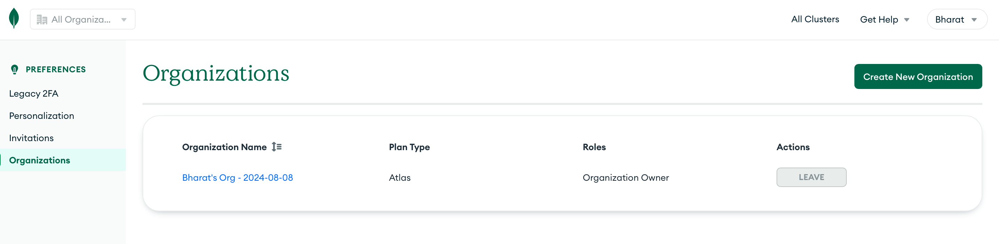
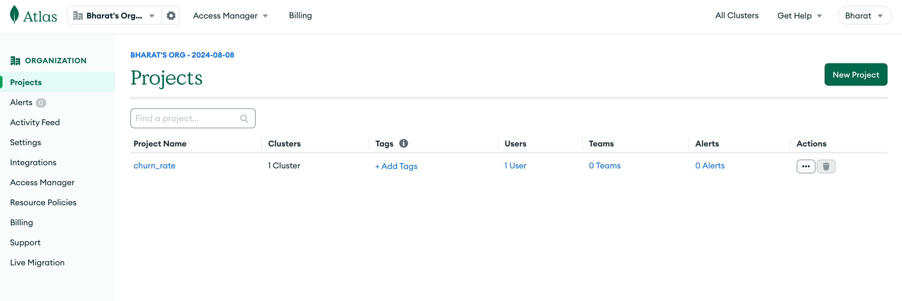
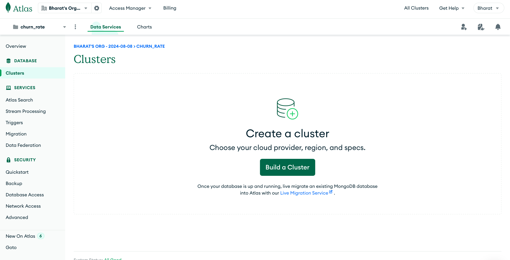
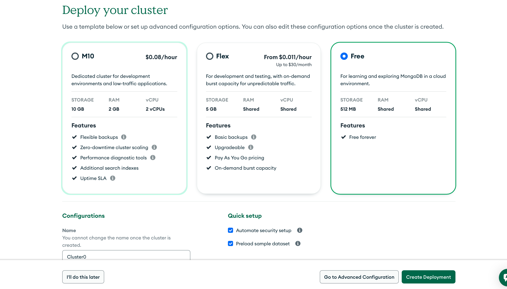
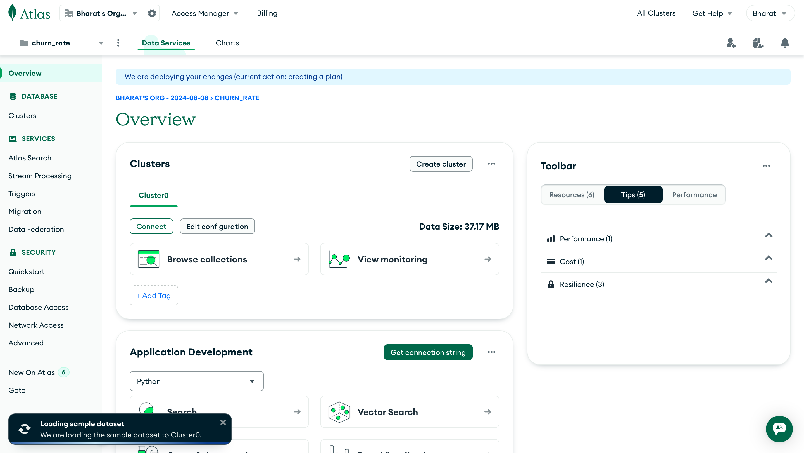
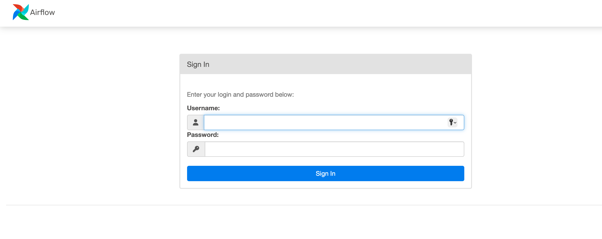
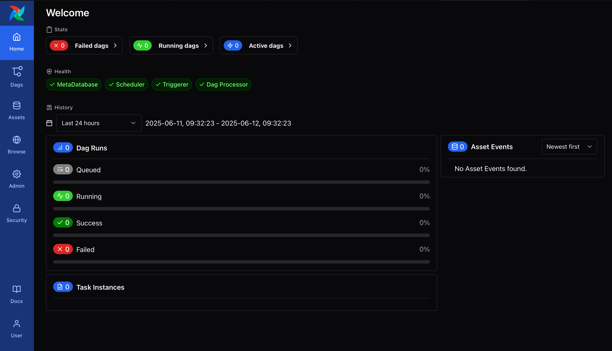

# 📊 Customer Churn Prediction Pipeline

This project demonstrates a **production-ready, end-to-end Machine Learning pipeline** to predict whether a customer is likely to churn. Built with **Apache Airflow**, **Docker**, and exposed via a **Streamlit APP**, the architecture is modular, scalable, and reproducible.

---

## 🚀 Project Overview

* **Objective:** Predict customer churn based on historical behavioral data.
* **Pipeline Highlights:**

  * Orchestrated with **Apache Airflow DAGs**
  * **Dockerized** components for reproducibility
  * Deployed using **Docker Compose**
  * Distinct stages: data ingestion → transformation → training → evaluation → packaging
  * Real-time inference through a **Streamlit APP**

---

## 🛠️ Tools & Technologies

### 🌀 Apache Airflow

* **Purpose:** Workflow orchestration of ETL and ML tasks.
* **How:** How: DAGs manage and link pipeline stages. In this project, Airflow is responsible for ingesting multiple raw CSV files over time from Google Drive, triggering the data processing pipeline after each ingestion. Once the data is cleaned and prepared, it's passed downstream for model training.
  
### 🐳 Docker

* **Purpose:** Environment consistency across development, testing, and production.
* **How:** Each pipeline stage runs in its own container.

### 🧹 Docker Compose

* **Purpose:** Simplifies multi-container orchestration.
* **How:** Spins up Airflow, pipeline services, and the REST API.

### ⚡ REST API (Streamlit APP)

* **Purpose:** Exposes a `/predict` endpoint for real-time inference.
* **How:** Loads serialized ML model and processes incoming data.

### 🐍 Python

* **Purpose:** Core language for ML, data preprocessing, and deployment.
* **How:** Powers each task script and the API backend.

---

## ✅ Key Benefits

* Modular and maintainable architecture.
* Easily deployable across environments.
* Clean separation of concerns.
* Real-time prediction ready via Streamlit APP.

---

## 🚀 Getting Started

### 1. Clone the Repository

```bash
git clone https://github.com/your-username/customer-churn-ml.git
cd customer-churn-ml
```

## 2️⃣ Environment Setup (Optional but Recommended)

```bash
# Create virtual environment
python -m venv venv

# Activate environment
source venv/bin/activate           # On Windows: venv\Scripts\activate

# Install dependencies
pip install -r requirements.txt
```

🔍 **Alternative:**  
Run the `testEnvironment.py` file to automatically set up the virtual environment and install dependencies.

🛠 Modify `setup.py` and `pyproject.toml` to reflect your author and project information.

---

## 3️⃣ Data Ingestion Pipeline

1. **Download Raw Data:**
   - Data is fetched from **Google Drive** and unzipped.

2. **Push to MongoDB:**
   - Extracted raw data is uploaded to **MongoDB Atlas**.

3. **Data Processing:**
   - Data is retrieved from MongoDB for processing and cleaning.

4. **Train-Test Split:**
   - Cleaned data is split into training and testing sets.

📂 All related scripts are available in `src/components/`.

---

## 4️⃣ MongoDB Atlas Setup

1. **Sign Up** at [mongodb.com](https://www.mongodb.com).
2. **Create Organization**  
   

3. **Create a New Project**  
   

4. **Build a Free Cluster**  
   

5. **Configure Cluster (Default Settings)**  
   

6. **Access Cluster Home Page**  
   

7. **Connect Application:**
   - Click `Connect` → Choose `Drivers` → Copy the connection string.
   - Save it in `.env` as:
     ```env
     MONGO_URI="your_mongo_connection_string"
     ```

## 5️⃣ Run with Docker Compose

```bash
docker-compose up --build
```

### 🔗 Access Services:

- **Airflow UI:** [http://localhost:8080](http://localhost:8080)  
- **API Endpoint (FastAPI):** [http://localhost:8000/predict](http://localhost:8000/predict)

---

## ⚙️ Manual Airflow Setup (Optional)

> 💡 Only needed if you're not using Docker Compose.

```bash
# Get the official Docker Compose file for Airflow
curl -LfO 'https://airflow.apache.org/docs/apache-airflow/3.0.2/docker-compose.yaml'

# Set up project directories
mkdir -p ./dags ./logs ./plugins

# Create .env file with user ID
echo -e "AIRFLOW_UID=$(id -u)" > .env

# Initialize Airflow metadata database
docker compose up airflow-init
```

### 🔐 Airflow Login Credentials

- **Username:** `airflow`  
- **Password:** `airflow`

#### Login Interface  


#### Airflow Dashboard  


---

🧠 What is MLflow?

**MLflow** is an open-source platform that helps manage the end-to-end ML lifecycle, including:

- 🚀 **Experiment tracking**
- 📁 **Artifact logging**
- 📏 **Metrics and parameter logging**
- 📦 **Model versioning and registry**

---

## 🧩 How MLflow is Used in This Project

MLflow is integrated into the following pipeline stages:

| Stage                 | File/Class                | MLflow Logs                                         |
|-----------------------|---------------------------|-----------------------------------------------------|
| 📥 Data Upload        | `UploadData`              | Downloaded file path, download source URL, artifact |
| 🏗️ Data Ingestion     | `IngestData`              | MongoDB export, feature store path, artifact        |
| 🧹 Data Preprocessing | `DataPreprocess`          | Column encoding, split ratio, processed file paths  |
| 🤖 Model Training     | `ModelTraining`           | Model name, accuracy score, model artifacts         |

---

## 📂 MLflow Logging Directory

Logged data will be stored in a default directory like:

---

# 🚀 Deployment Guide: Streamlit App on GCP Compute Engine (Docker + Nginx)

This guide walks you through deploying only the `app/` directory containing your Streamlit prediction app to GCP Compute Engine using Docker and Nginx (reverse proxy).

---

## ✅ 1. Project Structure

Ensure your `app/` directory looks like this:

---

## 🐳 2. Dockerfile (inside `app/`)

Create a `Dockerfile` in `app/`:

```Dockerfile
FROM python:3.10-slim

WORKDIR /app

COPY requirements.txt .
RUN pip install --no-cache-dir -r requirements.txt

COPY . .

ENV STREAMLIT_SERVER_PORT=8501
ENV STREAMLIT_SERVER_ENABLECORS=false
ENV STREAMLIT_SERVER_HEADLESS=true

EXPOSE 8501

CMD ["streamlit", "run", "streamlit_app.py"]

📦 3. Build and Test Locally (Optional)

   ```bash
   cd app
   docker build -t streamlit-app .
   docker run -p 8501:8501 streamlit-app
   Visit http://localhost:8501 to test.
   ```

☁️ 4. Transfer Only the app/ Directory to GCP VM

   ```bash
   gcloud compute scp --recurse ./app your-instance-name:~/ --zone=your-zone
   ```

🔐 5. SSH Into Your VM

   ```bash
   gcloud compute ssh your-instance-name --zone=your-zone
   ```

🐳 6. Build Docker Image on the VM

   ```bash
   cd ~/app
   docker build -t streamlit-app .
   docker run -d -p 8501:8501 --name streamlit-app streamlit-app
   ```

🌐 7. Set Up Nginx as a Reverse Proxy

   Install Nginx:
   ```bash
   sudo apt update
   sudo apt install nginx -y
   Create Nginx Config:
   sudo nano /etc/nginx/sites-available/streamlit
   Paste the following:
   ```
   
   ```nginx
   server {
      listen 80;
      server_name _;

      location / {
         proxy_pass http://localhost:8501;
         proxy_set_header Host $host;
         proxy_set_header X-Real-IP $remote_addr;
      }
   }
   ```

   Enable Nginx Config:

   ```bash
   sudo ln -s /etc/nginx/sites-available/streamlit /etc/nginx/sites-enabled
   sudo rm /etc/nginx/sites-enabled/default
   sudo systemctl restart nginx
   ```

🌍 8. Access Your Streamlit App

   Visit your app in a browser:

   ```cpp
   http://<GCP_VM_EXTERNAL_IP>
   ```

## 📬 Contact

For queries, feedback, or contributions:

👤 [Bharat Aameriya](https://www.linkedin.com/in/bharat-aameriya-24579a261/)  
📂 Feel free to open an issue or submit a pull request on this repository.

---
