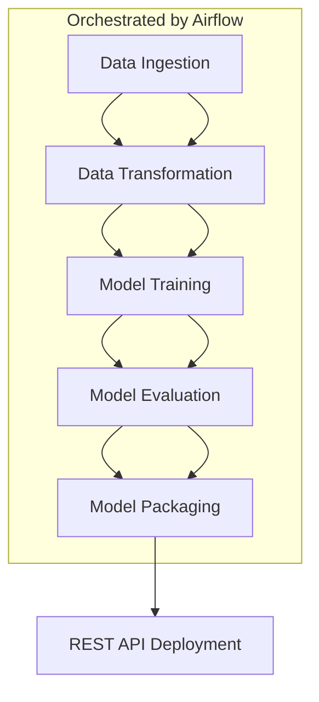

# 📊 Customer Churn Prediction Pipeline

This project builds a complete **end-to-end ML pipeline** to classify whether a customer is likely to churn. The system is modular, reproducible, and production-ready, built using **Apache Airflow**, **Docker**, and exposed through a **REST API**.

---

## 🚀 Project Overview

* **Objective:** Predict if a customer is likely to churn based on historical data.
* **Architecture:**

  * Pipeline managed as **Airflow DAGs**
  * All components are **Dockerized**
  * Deployment via **Docker Compose** on a virtual machine
  * Separate tasks for ingestion, transformation, training, evaluation, packaging
  * REST API for single-row inference

---

## 🛠️ Tools & Technologies Used

### 1. Apache Airflow

* **Why:** Workflow orchestration and scheduling of ML pipeline steps
* **How:** DAG defines and links pipeline tasks (ETL → train → evaluate → package)

### 2. Docker

* **Why:** Containerization ensures consistency across dev, test, and prod environments
* **How:** Each stage (ingestion, train, API) runs in its own container

### 3. Docker Compose

* **Why:** Simplifies multi-container deployment
* **How:** Defines and launches Airflow, services, and REST API together

### 4. REST API

* **Why:** Enables real-time inference for single customer data
* **How:** A FastAPI/Flask endpoint consumes serialized model for predictions

### 5. Python

* **Why:** Core language for data processing, ML, and serving
* **How:** Code for data ingestion, preprocessing, model training, and inference

---

## 🔄 Project Flow



### Step-by-Step Breakdown

1. **Data Ingestion**

   * Load raw data from a CSV, database, or API
   * Saved into a shared volume for next steps

2. **Data Transformation**

   * Clean, encode, and normalize features
   * Prepare final dataset for modeling

3. **Model Training**

   * Train a classification model (e.g., XGBoost/RandomForest)
   * Save model as serialized `.pkl`

4. **Model Evaluation**

   * Evaluate model using metrics like F1-score, ROC-AUC
   * Optional logging to a dashboard/DB

5. **Model Packaging**

   * Prepare model artifacts and config files for deployment

6. **Deployment & Inference API**

   * REST API (FastAPI or Flask) loads model
   * Supports single-row input and returns churn prediction

---

## 📦 Folder Structure

```
├── dags/
│   └── churn_pipeline_dag.py
├── docker/
│   ├── Dockerfile.ingest
│   ├── Dockerfile.transform
│   ├── Dockerfile.train
│   ├── Dockerfile.evaluate
│   ├── Dockerfile.api
├── docker-compose.yml
├── api/
│   └── app.py
├── data/
│   └── raw, processed
├── models/
│   └── trained_model.pkl
```

---

## 📈 Results & Output

* Logs for each stage stored by Airflow
* Metrics printed in evaluation logs
* API exposes `/predict` endpoint

---

## 💡 Benefits

* Reproducible and modular architecture
* Easily scalable and portable
* Clean separation of concerns (ETL, modeling, serving)
* Real-time API ready for production

---

## 📌 To Run the Project

```bash
docker-compose up --build
```

Then access:

* **Airflow UI:** [http://localhost:8080](http://localhost:8080)
* **API Endpoint:** [http://localhost:8000/predict](http://localhost:8000/predict)
