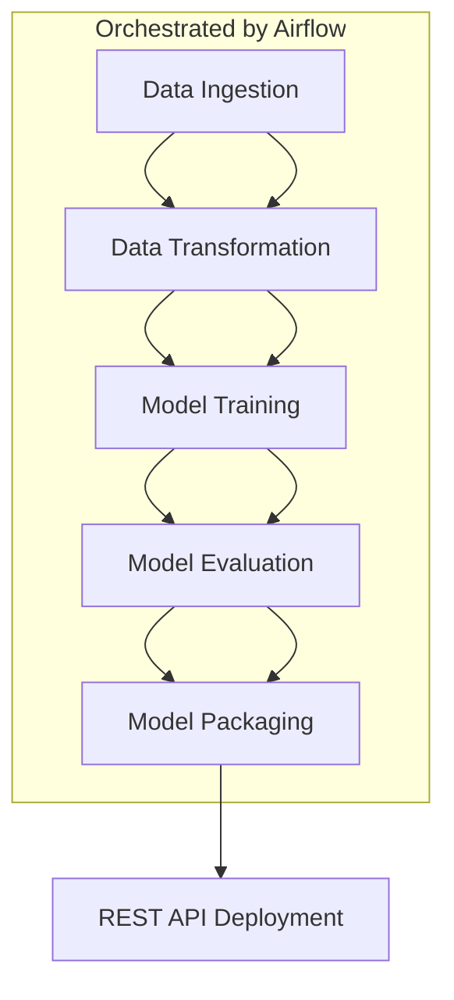

# 📊 Customer Churn Prediction Pipeline

This project demonstrates a **production-ready, end-to-end Machine Learning pipeline** to predict whether a customer is likely to churn. Built with **Apache Airflow**, **Docker**, and exposed via a **REST API**, the architecture is modular, scalable, and reproducible.

---

## 🚀 Project Overview

* **Objective:** Predict customer churn based on historical behavioral data.
* **Pipeline Highlights:**

  * Orchestrated with **Apache Airflow DAGs**
  * **Dockerized** components for reproducibility
  * Deployed using **Docker Compose**
  * Distinct stages: data ingestion → transformation → training → evaluation → packaging
  * Real-time inference through a **REST API**

---

## 🛠️ Tools & Technologies

### 🌀 Apache Airflow

* **Purpose:** Workflow orchestration of ETL and ML tasks.
* **How:** DAGs manage and link pipeline stages.

### 🐳 Docker

* **Purpose:** Environment consistency across development, testing, and production.
* **How:** Each pipeline stage runs in its own container.

### 🧹 Docker Compose

* **Purpose:** Simplifies multi-container orchestration.
* **How:** Spins up Airflow, pipeline services, and the REST API.

### ⚡ REST API (FastAPI / Flask)

* **Purpose:** Exposes a `/predict` endpoint for real-time inference.
* **How:** Loads serialized ML model and processes incoming data.

### 🐍 Python

* **Purpose:** Core language for ML, data preprocessing, and deployment.
* **How:** Powers each task script and the API backend.

---

## 🔄 Project Workflow



### 📌 Step-by-Step Flow

1. **Data Ingestion**

   * Load raw data from CSV/database/API.
   * Store in shared volume for pipeline access.

2. **Data Transformation**

   * Clean, encode, and normalize features.
   * Output ready for model training.

3. **Model Training**

   * Train a classification model (e.g., RandomForest, XGBoost).
   * Save as `.pkl` for later inference.

4. **Model Evaluation**

   * Evaluate using metrics like **F1-score**, **ROC-AUC**.
   * Optionally log results for dashboarding.

5. **Model Packaging**

   * Bundle model and config for serving.

6. **API Deployment**

   * Load model via FastAPI/Flask.
   * Accept single-row JSON input, return churn prediction.

---

## 📂 Folder Structure

```
├── dags/
│   └── churn_pipeline_dag.py
├── docker/
│   ├── Dockerfile.ingest
│   ├── Dockerfile.transform
│   ├── Dockerfile.train
│   ├── Dockerfile.evaluate
│   ├── Dockerfile.api
├── docker-compose.yml
├── api/
│   └── app.py
├── data/
│   └── raw/ processed/
├── models/
│   └── trained_model.pkl
```

---

## 📈 Results & Output

* Logs from each step managed by Airflow.
* Evaluation metrics printed to logs or exported.
* Inference API exposed at `/predict`.

---

## ✅ Key Benefits

* Modular and maintainable architecture.
* Easily deployable across environments.
* Clean separation of concerns.
* Real-time prediction ready via REST API.

---

## 🚀 Getting Started

### 1. Clone the Repository

```bash
git clone https://github.com/your-username/customer-churn-ml.git
cd customer-churn-ml
```

### 2. Set Up Virtual Environment (Optional)

```bash
python -m venv venv
source venv/bin/activate  # Windows: venv\Scripts\activate
pip install -r requirements.txt
```

### 3. Run with Docker Compose

```bash
docker-compose up --build
```

Access:

* **Airflow UI:** [http://localhost:8080](http://localhost:8080)
* **API Endpoint:** [http://localhost:8000/predict](http://localhost:8000/predict)

---

## ⚙️ Airflow Setup (Manual Option)

> Ensure Docker Desktop is installed and running.

```bash
# Download Docker Compose file
curl -LfO 'https://airflow.apache.org/docs/apache-airflow/3.0.2/docker-compose.yaml'

# Create folders and env file
mkdir -p ./dags ./logs ./plugins
echo -e "AIRFLOW_UID=$(id -u)" > .env

# Initialize Airflow
docker compose up airflow-init
```

### 🔐 Airflow Login

* Username: `airflow`
* Password: `airflow`

#### 🔎 Login Page


#### 🏠 Home Page


## 📬 Contact

For feedback or contributions, reach out via [LinkedIn](https://www.linkedin.com/in/bharat-aameriya-24579a261/) or open an issue in the repository.
